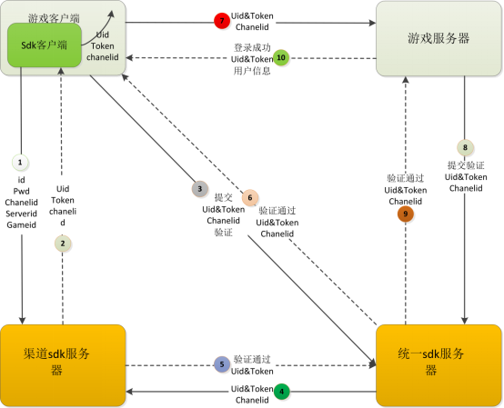
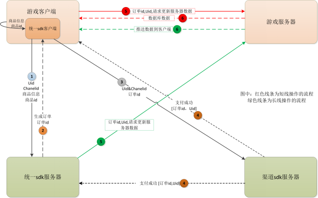

# Android SDK 接入

本文为Android客户端接入本SDK的使用教程，只涉及SDK的使用方法，默认读者已经熟悉IDE的基本使用方法（本文以AndroidStudio为例），以及具有相应的编程知识基础等。

### 准备阶段

- 需要先将游戏内的可购买商品列表发送给发行商，物品属性包含物品id、物品价格、物品在游戏中对应的点数、物品描述等
- 发行商像开发商提供`appId`、`appSecret`、`channelId`等配置信息

### 一、游戏配置

#### 1.1 AndroidManifest.xml配置

**当游戏没有定义过自己的Application时**

application下配置icon属性及name属性为com.towersdk.union.android.IctitanUnionApplication

```xml
<application
    android:name="com.ictitan.union.IctitanUnionApplication"
    android:allowBackup="true"
    android:icon="@drawable/ic_launcher"
    android:label="@string/app_name">
    ...
</application>
```

游戏主窗体启动模式改为`android:launchMode="singleTop"`

**当游戏定义了自己的的Application时**

则更改方式如下：

1、在application中增加meta-data

```xml
<application
    android:name="com.ictitan.union.IctitanUnionApplication"
    android:allowBackup="true"
    android:icon="@drawable/ic_launcher"
    android:label="@string/app_name">

    <meta-data android:name="ICTITAN_APPLICATION_PROXY_NAME" android:value="com.xxx.GameProxyApplication" />
    ...
</application>
```

2、将游戏的Application实现IIctitanUnionApplicationListener接口

```java
package com.xxx;

import com.ictitan.union.callback.IIctitanUnionApplicationListener;

public class GameProxyApplication implements IIctitanUnionApplicationListener {

    @Override
    public void onProxyCreate() {
        // TODO 需要在Application的onCreate中的操作，放在这里
        // 如果需要获取到原始Application对象，通过 IctitanUnionSDK.getInstance().getApplication()来获取
        Log.d("Game", "On Application Create");
    }

    @Override
    public void onProxyAttachBaseContext(Context base) {
        // TODO 需要在Application的attachBaseContext中的操作，放在这里
    }

    @Override
    public void onProxyConfigurationChanged(Configuration config) {
        // TODO 需要在Application的onConfigurationChanged中的操作，放在这里
    }
}
```

**配置权限**

```xml
<uses-permission android:name="android.permission.INTERNET" />
<uses-permission android:name="android.permission.ACCESS_WIFI_STATE" />
<uses-permission android:name="android.permission.SYSTEM_ALERT_WINDOW" />
<uses-permission android:name="android.permission.ACCESS_NETWORK_STATE" />
```

**参数配置**

配置默认的游戏测试大区ID和渠道ID

```xml
<meta-data android:name="ICTITAN_UNION_APP_ID" android:value="{AppId}" />
<meta-data android:name="ICTITAN_UNION_CHANNEL_ID" android:value="{ChannelId}" />
```

导入`ictitan-union-xxx.jar`、`httpcore-4.4.9.jar`和`httpclient-4.5.5.jar`并引入该jar包

**其他注意事项**

- 项目targetSdkVersion必须设置为<span style="color:red">27</span>
- Unity3D游戏工程关闭自动权限申请功能

```xml
<application>
   <meta-data android:name="unityplayer.SkipPermissionsDialog" android:value="true" />
</application>
```

- <span style="color:red">删除隐私敏感权限</span>：`android.permission.READ_PHONE_STATE`（GooglePlay禁止获取imei）
- 文件操作请在<span style="color:red">应用私有目录</span>中进行，避免在SD卡公共目录中进行文件读写操作（可以避免申请外部存储权限）

#### 1.2 资源配置

配置游戏各像素icon图标，分别在**drawable-hdpi**、**drawable-ldpi**、**drawable-mdpi**、**drawable-xhdpi**、**drawable-xxhdpi**、**drawable-xxxhdpi**下配置对应像素为**72\*72**、**36\*36**、**48\*48**、**96\*96**、**144\*144**、**192\*192**的游戏icon，注意：icon像素必须匹配，drawable中不添加游戏icon

### 二、游戏调用平台

注：以下接口暂只提供直java层，具体java层与游戏层数据交互由接入方自行实现

#### 2.1 初始化(必接)

```java
IctitanUnionSDK.getInstance().init(activity);
```

参数是游戏窗体对象（注意：必须游戏界面未启动前调用该接口，如不能保证可放在游戏主窗的的onCreate生命周期中执行）

#### 2.2 登录(必接)

```java
IctitanUnionSDK.getInstance().login();
```

游戏点击登录游戏按钮调用。



#### 2.3 游戏服角色信息上报(必接)

当玩家选择游戏服后需要上报游戏服信息

```java
String serverId = "玩家所选服务器ID";
String serverName = "玩家所选服务器名字";
// 登录游戏服上报
IctitanUnionSDK.getInstance().reportGameServer(serverId, serverName);
```

当玩家创建角色的时候需要上报新角色信息

```java
String serverId = "玩家所选服务器ID";
String serverName = "玩家所选服务器名字";
String roleId = "创建的角色ID";
String roleName = "创建的角色名字";
String profession = "创建的角色对应职业";
// 创角上报
IctitanUnionSDK.getInstance().createGameRole(serverId, serverName, roleId, roleName, profession);
```

当玩家角色进入游戏的时候需要上报角色信息

```java
String serverId = "玩家所选服务器ID";
String serverName = "玩家所选服务器名字";
String roleId = "创建的角色ID";
String roleName = "创建的角色名字";
String profession = "角色对应职业";
String level = "角色等级";
// 进入游戏上报
IctitanUnionSDK.getInstance().roleEnterGame(serverId, serverName, roleId, roleName, profession, level);
```

当玩家角色等级升级时上报

```java
String serverId = "玩家所选服务器ID";
String serverName = "玩家所选服务器名字";
String roleId = "角色ID";
String roleName = "角色名字";
String profession = "角色对应职业";
String level = "角色等级";
// 等级升级上报
IctitanUnionSDK.getInstance().roleLevelUpgrade(serverId, serverName, roleId, roleName, profession, level);
```

#### 2.4 支付(必接)

```java
String serverId = "玩家所在服务器ID，不可为空或0";
String serverName = "玩家所在服务器名";
String roleId = "玩家的游戏角色ID";
String roleName = "玩家的游戏角色名";
String roleLevel = "玩家的角色等级";
String roleProfession = "玩家的角色职业，没有可传空字符串";
String productId = "游戏中商品ID";
String description = "商品描述";
float amount = 1f;
String currency = "USD";
String extra = "支付成功时原样返回至游戏服务器的额外参数";
// 进行支付
IctitanUnionSDK.getInstance().pay(new IctitanUnionPaymentParam(serverId, serverName, roleId, roleName, roleLevel, roleProfession, productId, description, amount, currency, extra));
```

整个支付流程如下：



#### 2.5 是否使用SDK的退出游戏功能(必接)

```java
return IctitanUnionSDK.getInstance().isUnionExitGame();
```

退出游戏判断是否使用第三方退出功能。

返回值：返回true表示使用第三方退出界面退出游戏，返回false表示使用游戏原生退出界面；参数：无。

#### 2.6 退出游戏(必接)

```java
if (IctitanUnionSDK.getInstance().isUnionExitGame()) {
    IctitanUnionSDK.getInstance().exitGame();
} else {
    //System.exit(0);
    //CP处理
}
```

得到返回是第三方退出后调用。

返回值：无；参数：无。

#### 2.7 用户中心(选接)

```java
IctitanUnionSDK.getInstance().showUserCenter();
```

返回值：无；参数：无。（该接口为预留接口，部分渠道无此接口，游戏不需接入）

#### 2.8 浮窗控制(选接)

```java
IctitanUnionSDK.getInstance().showOrHiddenFloatMenu(isShow);
```

返回值：无；参数：true为显示窗，false为关闭浮窗。（部分渠道无此接口，暂只支持部分渠道）

#### 2.9 用户登出(选接)

```java
IctitanUnionSDK.getInstance().logout();
```

返回值：无；参数：无。（该接口为预留接口，部分渠道无此接口，游戏不需接入）

#### 2.10 事件打点通用接口(必接)

```java
Map<String,Object> eventParams = new HashMap<String ,Object>();
eventParams.put("level", 20);
eventParams.put("utype", "task");

// UpgradeLevel 为事件名称，请参考运营对接文档
IctitanUnionSDK.getInstance().trackEvent("UpgradeLevel", eventParams);
```

#### 2.11 分享功能

```java
String shareId = "发行商平台分配的分享id";
Map<String,Object> shareParams = new HashMap<String ,Object>();
shareParams.put("displayName", "你好啊");

IctitanUnionSDK.getInstance().shareToSocialNetwork(shareId, shareParams);
```

#### 2.12 应用权限动态申请

```java
IctitanUnionSDK.getInstance().requestPermission("android.permission.READ_EXTERNAL_STORAGE", "权限申请描述文字", new IctitanUnionPermissionCallback() {
    @Override
    public void onPermissionGranted() {
        //玩家已授权该权限
    }

    @Override
    public void onPermissionDenied() {
        //玩家拒绝授权
    }
});
```

#### 2.13 Activity生命周期(必接)

游戏主窗体中直接重写一下父类方法：

```java
public void onActivityResult(int requestCode, int resultCode, Intent data) {
    IctitanUnionSDK.getInstance().onActivityResult(requestCode, resultCode, data);
    super.onActivityResult(requestCode, resultCode, data);
}

public void onPause() {
    IctitanUnionSDK.getInstance().onPause();
    super.onPause();
}

protected void onStart() {
    IctitanUnionSDK.getInstance().onStart();
    super.onStart();
}

public void onResume() {
    IctitanUnionSDK.getInstance().onResume();
    super.onResume();
}

public void onNewIntent(Intent newIntent) {
    IctitanUnionSDK.getInstance().onNewIntent(newIntent);
    super.onNewIntent(newIntent);
}

public void onStop() {
    IctitanUnionSDK.getInstance().onStop();
    super.onStop();
}

public void onDestroy() {
    IctitanUnionSDK.getInstance().onDestroy();
    super.onDestroy();
}

public void onRestart() {
    IctitanUnionSDK.getInstance().onRestart();
    super.onRestart();
}

public void onBackPressed() {
    IctitanUnionSDK.getInstance().onBackPressed();
    super.onBackPressed();
}
```

### 三、平台回调

当游戏Activity初始化时，定义IctitanUnion的回调方法

```java
IctitanUnionSDK.getInstance().setSDKListener(new IIctitanUnionListener() {
    // 初始化回调
    @Override
    public void IctitanUnionInitCallback(int code, String result) {
        ...
    }

    // 登陆回调
    @Override
    public void IctitanUnionLoginCallback(int code, String result, UnionSdkUser user) {
        if (code == UnionSDKCallbackCode.CODE_LOGIN_SUCCESS) {
            // user.accountId   帐号唯一标识
            // user.token       登陆令牌
            // user.channelId   渠道id
            // user.appId       游戏id
            // user.avatarUrl   用户头像URL
            // user.nickname    昵称
            // user.type        帐号类型(facebook,google,apple,guest,amazon)    
        }
    }

    // 注销回调
    @Override
    public void IctitanUnionLogoutCallback(int code, String result) {
        ...
    }

    // 支付回调
    @Override
    public void IctitanUnionPayCallback(int code, String result) {
        ...
    }

    // 退出游戏回调
    @Override
    public void IctitanUnionExitGameCallback(int code, String result) {
        ...
    }

    // 分享回调
    @Override
    public void IctitanUnionShareToSocialNetworkCallback(int code, String result) {
        ...
    }
}
```

#### 回调参数

|code参数|参数数值|参数说明|
|---|---|---|
|UnionSDKCallbackCode.CODE\_NO\_NETWORK|0|网络连接失败|
|UnionSDKCallbackCode.CODE\_INIT\_SUCCESS|1|初始化成功|
|UnionSDKCallbackCode.CODE\_INIT\_FAIL|2|初始化失败|
|UnionSDKCallbackCode.CODE\_UNINIT|3|没有初始化|
|UnionSDKCallbackCode.CODE\_LOGIN\_SUCCESS|4|登陆成功|
|UnionSDKCallbackCode.CODE\_LOGIN\_FAIL|5|登陆失败|
|UnionSDKCallbackCode.CODE\_LOGIN\_CANCEL|6|登陆取消|
|UnionSDKCallbackCode.CODE\_LOGIN\_TIMEOUT|7|登陆超时|
|UnionSDKCallbackCode.CODE\_UNLOGIN|8|没有登陆|
|UnionSDKCallbackCode.CODE\_LOGOUT\_SUCCESS|9|退出账户成功|
|UnionSDKCallbackCode.CODE\_LOGOUT\_FAIL|10|退出账户失败|
|UnionSDKCallbackCode.CODE\_PAY\_SUCCESS|11|支付成功|
|UnionSDKCallbackCode.CODE\_PAY\_FAIL|12|支付失败|
|UnionSDKCallbackCode.CODE\_PAY\_CANCEL|13|支付取消|
|UnionSDKCallbackCode.CODE\_EXIT\_SUCCESS|14|退出游戏成功|
|UnionSDKCallbackCode.CODE\_EXIT\_FAIL|15|退出游戏失败|
|UnionSDKCallbackCode.CODE\_SHARE\_SUCCESS|16|分享成功|
|UnionSDKCallbackCode.CODE\_SHARE\_FAIL|17|分享失败|
|UnionSDKCallbackCode.CODE\_SHARE\_CANCEL|18|分享取消|

### 四、打包注意事项

在build.gradle文件中加入：

```groovy
packagingOptions {
    exclude 'META-INF/LICENSE'
    exclude 'META-INF/NOTICE'
    exclude 'META-INF/DEPENDENCIES'
    exclude 'META-INF/MANIFEST.MF'
}

android {
    lintOptions {
        abortOnError false
    }
}
```

### FAQ

1. 由于渠道商这边很多渠道都不存在商品表，所以需要研发在传商品ID和商品价格给统一sdk的时候做一下验证，避免在支付过程中遭到篡改，比如商品ID为1的商品，价格100元，可能会被篡改成价格为10元，然后发钻石的时候还是按照ID为1的商品来发放，就会出现问题
2. 对于应用宝渠道，不走商品表，只需要在应用宝平台配置一个兑换比率，所以研发要留意兑换比率不可变，所有档位的计费点都一样
3. 游戏在加元宝的时候请以服务器端的接口回调通知为准，不要直接以sdk的通知回调作为加元宝的凭据（无论游戏是推送还是客户端查询）。

