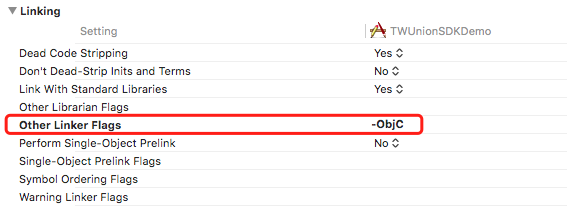
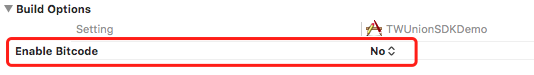

# iOS SDK 接入

**修改记录**

| 修订号   | 修改描述       | 修改日期       |
| ----- | -------- |  ---------- |
| 1.0.0 | 初稿完成       | 2019-03-22 |
| 1.1.0 | 删除配置手机App白名单、配置手机App跳转URLTypes；增加continueUserActivity重新方法       | 2019-04-11 |

本文为iOS客户端接入本SDK的使用教程，只涉及SDK的使用方法，默认读者已经熟悉IDE的基本使用方法（本文以Xcode为例），以及具有相应的编程知识基础等。

### 准备阶段

- 需要先将游戏内的可购买商品列表发送给发行商，物品属性包含物品id、物品价格、物品在游戏中对应的点数、物品描述等
- 发行商向开发商提供`appId`、`appSecret`、`channelId`、`initUrl`等配置信息

### 一、游戏配置

#### 1.1 Info.plist配置

**配置游戏聚合平台参数**

在`Info.plist`里添加**游戏ID**和**游戏渠道ID**，其中的`appId`、`channelId`、`initUrl`值是IctitanUnion平台分配的值

源码方式添加如下：

```xml
<key>IctitanUnionAppId</key>
<string>{AppId}</string>
<key>IctitanUnionChannelId</key>
<string>{ChannelId}</string>
<key>IctitanUnionInitUrl</key>
<string>{InitUrl}</string>
```

**配置网络(使用HTTP)**

在`TARGETS -> Info -> Custom iOS Target Properties`中添加`App Transport Security Settings`，并设置`Allow Arbitrary Loads`为`YES`


源码方式添加如下：

```xml
<key>NSAppTransportSecurity</key>
<dict>
    <key>NSAllowsArbitraryLoads</key>
    <true/>
</dict>
```

**配置本地语言可获取**

在`TARGETS -> Info -> Custom iOS Target Properties`中添加`Localized resources can be mixed`和`Privacy - Photo Library Usage Description`，并设置`Allow Arbitrary Loads`为`YES`

#### 1.2 通用配置

**配置全屏**

在`TARGETS -> General -> Deployment Info -> Status Bar Style`中勾选上`Requires full screen`


**开启三方静态库**

在`TARGET -> Build Settings -> Linking -> Other Liker Flags`中添加`-ObjC`



**关闭bitcode**

将`TARGET -> Build Settings -> Build Options -> Enable Bitcode`设置成`No`



**设置依赖库**

在`TARGET -> Build Phases`中添加如下依赖库


### 二、聚合SDK接入说明

#### 2.1 初始化

请在iOS程序的`AppDelegate.m`里的`(BOOL)application:didFinishLaunchingWithOptions:`进行调用：

引入header文件

```objective-c
#import "IctitanUnionSDK.h"
#import "ITTType.h"
```

在`(BOOL)application:(UIApplication *)application didFinishLaunchingWithOptions:(NSDictionary *)launchOptions`插入如下代码:

```objective-c
- (BOOL)application:(UIApplication *)application didFinishLaunchingWithOptions:(NSDictionary *)launchOptions {
    ...
    //ITTDebugStatusOn 开启调试
    //ITTDebugStatusOff 关闭调试，正式上线时候请关闭日志
    [[IctitanUnionSDK sharedInstance] init:ITTDebugStatusOn];

    ...
    return YES;
}
```

重写AppDelegate的openURL、applicationDidBecomeActive以及continueUserActivity

```objective-c
// 如果iOS SDK版本小于9
- (BOOL)application:(UIApplication *)application openURL:(NSURL *)url sourceApplication:(NSString *)sourceApplication annotation:(id)annotation {
    return [[IctitanUnionSDK sharedInstance application:application openURL:url sourceApplication:sourceApplication annotation:annotation];
}

// 如果iOS SDK版本大于或等于9
- (BOOL)application:(UIApplication *)application openURL:(NSURL *)url options:(NSDictionary<UIApplicationOpenURLOptionsKey,id> *)options {
    return [[IctitanUnionSDK sharedInstance] application:application openURL:url options:options];
} 

- (void)applicationDidBecomeActive:(UIApplication *)application {
    [[IctitanUnionSDK shareInstance] applicationDidBecomeActive:application];
}

- (BOOL)application:(UIApplication *)application continueUserActivity:(NSUserActivity *)userActivity restorationHandler:(void (^)(NSArray *_Nullable))restorationHandler {
    return [[IctitanUnionSDK shareInstance] continueUserActivity:userActivity restorationHandler:restorationHandler];
}
```

#### 2.2 回调接口

在游戏界面显示时，给SDK设置可以依附的UIViewController对象，并在该类文件增加IctitanUnionDelegate协议，请在此协议中实现游戏的初始化、登录、注销、支付、分享功能

```objective-c
#import "IctitanUnionSDK.h"
#import "IctitanUnionDelegate.h"
#import "ITTUser.h"
#import "ITTType.h"

@interface ViewController () <IctitanUnionDelegate>
@property (nonatomic, strong) ITTUser *user;
@end

@implementation ViewController

- (void)viewDidLoad {
    [super viewDidLoad];
    // 设置回调主体
    [[IctitanUnionSDK shareInstance] setCallBackController:self];
}

// 初始化回调
- (void)IctitanUnionInitCallback:(UnionSdkCallbackCode)code andMessage:(NSString *)message {
    if (ITTCodeSuc == code) {
        //初始化成功
        NSLog(@"初始化成功");
    } else if (ITTCodeFail == code) {
        //初始化失败
        NSLog(@"初始化失败，msg=%@",message);
    }
}

// 登录回调
- (void)IctitanUnionLoginCallback:(UnionSdkCallbackCode)code andMessage:(NSString *)message andUser:(UnionSdkUser *)user {
    if (ITTCodeSuc == code) {
        //登录成功
        NSLog(@"登录成功");
        _user = user;
        // user.accountId   帐号唯一标识
        // user.token       登陆令牌
        // user.channelId   渠道id
        // user.appId       游戏id
        // user.avatarUrl   用户头像URL
        // user.nickname    昵称
        // user.type        帐号类型(facebook,google,apple,guest,amazon)
    } else if (ITTCodeFail == code) {
        //登录失败
        NSLog(@"登录失败：%@", message);
    }
}

// 注销回调
- (void)IctitanUnionLogoutCallback:(UnionSdkCallbackCode)code andMessage:(NSString *)message {
    if (ITTCodeSuc == code) {
        //注销成功
        NSLog(@"注销成功");
        _user = nil;
    } else if (ITTCodeFail == code) {
        //注销失败
        NSLog(@"注销失败，msg=%@", message);
    }
}

// 支付回调
- (void)IctitanUnionLogoutCallback:(UnionSdkCallbackCode)code andMessage:(NSString *)message {
    if (ITTCodeSuc == code) {
        //支付成功，订单数据通过服务端接口回调
        NSLog(@"支付成功");
    } else if (ITTCodeFail == code) {
        //支付失败
        NSLog(@"支付失败，msg=%@", message);
    }
}

// 分享回调
- (void)IctitanUnionShareToSocialNetworkCallback:(UnionSdkCallbackCode)code andMessage:(NSString *)message {
    if (ITTCodeSuc == code) {
        //分享成功
        NSLog(@"分享成功");
    } else if (ITTCodeFail == code){
        //分享失败
        NSLog(@"分享失败，msg=%@", message);
    }
}

@end
```

#### 2.3 登录

请在iOS程序的`ViewController.m`里的**按钮点击事件**或者**加载事件**中进行调用：

引入header文件

```objective-c
#import "IctitanUnionSDK.h"
```

事件中插入如下代码：

```objective-c
[[IctitanUnionSDK shareInstance] login];
```

#### 2.4 注销

在注销账号或切换账号时, 请务必调⽤用此接⼝, 再调⽤用登录接⼝。

请在iOS程序的`ViewController.m`里的**按钮点击事件**或者**加载事件**中进行调用：

引入header文件

```objective-c
#import "IctitanUnionSDK.h"
```

事件中插入如下代码：

```objective-c
[[IctitanUnionSDK shareInstance] logout];
```

#### 2.5 游戏服角色信息上报

当玩家创建角色、进入游戏、角色等级升级的时候需要上报新角色信息

引入header文件

```objective-c
#import "IctitanUnionSDK.h"
#import "ITTRole.h"
#import "ITTType.h"
```

事件中插入如下代码：

```objective-c
ITTRole *param = [[ITTRole alloc] init];
[param setServerId:@"玩家所在服务器ID，不可为空或0"];
[param setServerName:@"玩家所在服务器名"];
[param setRoleId:@"玩家的游戏角色ID"];
[param setRoleName:@"玩家的游戏角色名"];
[param setRoleLevel:@"玩家的角色等级"];
[param setRoleProfession:@"玩家的角色职业，没有可传空字符串"];
// ITTReportType角色事件类型:
// ITTROLE_EVENT_CREATE           创角
// ITTROLE_EVENT_ENTERGAME        进入游戏
// ITTROLE_EVENT_LEVELUPGRADE     升级
[param setSendType:ITTROLE_EVENT_ENTERGAME];
// 等级升级上报
[[IctitanUnionSDK shareInstance] reportRoleInfo:param];
```

#### 2.6 支付

需要传递完整的商品信息。

请在iOS程序的`ViewController.m`里的**按钮点击事件**或者**加载事件**中进行调用：

引入header文件

```objective-c
#import "IctitanUnionPaymentParam.h"
#import "IctitanUnionSDK.h"
```

事件中插入如下代码：

```objective-c
IctitanUnionPaymentParam *param = [[IctitanUnionPaymentParam alloc] init];
[param setServerId:@"玩家所在服务器ID，不可为空或0"];
[param setServerName:@"玩家所在服务器名"];
[param setRoleId:@"玩家的游戏角色ID"];
[param setRoleName:@"玩家的游戏角色名"];
[param setRoleLevel:@"玩家的角色等级"];
[param setRoleProfession:@"玩家的角色职业，没有可传空字符串"];
[param setProductId:@"游戏中商品ID"];
[param setProductDescription:@"商品描述"];
[param setAmount:@"购买该商品所需金额，如：1.0"];
[param setCurrency:@"金额对应的币种，如：USD"];
[param setExtra:@"支付成功时原样返回至游戏服务器的额外参数"];

[[IctitanUnionSDK shareInstance] pay:param];
```

#### 2.7 调出用户中心

```objective-c
[[IctitanUnionSDK shareInstance] showUserCenter];
```

#### 2.8 浮窗控制

```objective-c
BOOL isShow = YES;

[[IctitanUnionSDK shareInstance] showOrHiddenFloatMenu:isShow];
```

isShow参数：true为显示窗，false为关闭浮窗。（部分渠道无此接口，暂只支持部分渠道）

#### 2.9 事件打点通用接口

```objective-c
NSDictionary *eventParams = @{@"level": 20, @"utype": @"task"};

// UpgradeLevel 为事件名称，请参考运营对接文档
[[IctitanUnionSDK shareInstance] trackEvent:@"UpgradeLevel" andEventParams:eventParams];
```

#### 2.10 分享功能

```objective-c
NSString *shareId = @"发行商平台分配的分享id";
NSDictionary *shareParams = @{@"displayName": @"你好啊"};

[[IctitanUnionSDK shareInstance] shareToSocialNetwork:shareId andShareParams:shareParams];
```
