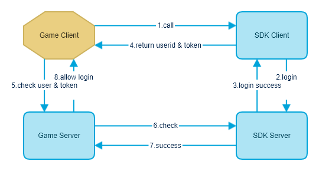

# 登录验证

### 接口说明

为了保证游戏足够的安全性，我们提供登录验证接口供开发商校验，而且这一步必须是Server To Server。我们强烈建议游戏商必须做这一步动作。

### 请求地址

https://api.onesdk.ictitan.com/verify/unionAuthentication

### 流程图



游戏商实现部分为 5,6,7,8 步骤

### HTTP请求方式(游戏商服务器请求发行商服务器)

POST

### 请求参数

|字段名|是否必填|类型|说明|
|---|---|---|---|
|appId|是|int|游戏唯一ID。（等同于clientId）|
|accountId|是|string|平台账号ID，由SDK提供|
|token|是|string|平台账号Token，由SDK提供|
|time|是|int|10位时间戳|
|signature|是|string|签名 [参考签名规则](server-api-overview.md#签名规则)|

**appId （等同于clientId） 和 appSecret （等同于clientSecret） 由发行商提供，请找我方索取。**

### 返回结果JSON

```json
// 成功示例
{
    "resultCode": 200,
    "message": "OK",
    "data": []
}
// 失败示例
{
    "resultCode": 40001,
    "message": "Invalid parameter",
    "data": ["appId cannot be blank.", "accountId cannot be blank.", "token cannot be blank."]
}
```

### PHP 示例代码

```php
// appId（等同于clientId）
$appId = 1000;
// appSecet（等同于clientSecret）
$appSecret = 'bf777d95077720953a67d367e0a6628';
$api = 'https://api.onesdk.ictitan.com/verify/unionAuthentication';

$params['appId'] = $appId;
$params['accountId'] = 10000017;
$params['token'] = '882202804b365372019d7c5170d4abfdf8a68e3b';
$params['time'] = time();

ksort($params);
$linkString = '';
foreach ($params as $k => $v) {
    $linkString .= $k.'='.$v.'&';
}
$linkString = rtrim($linkString, '&');
$params['signature'] = md5($linkString.$appSecret);

$ch = curl_init();
curl_setopt($ch, CURLOPT_URL, $api);
curl_setopt($ch, CURLOPT_POST, 1);
curl_setopt($ch, CURLOPT_POSTFIELDS, $params);
curl_setopt($ch, CURLOPT_RETURNTRANSFER, true);
$response = curl_exec($ch);
curl_close($ch);
print_r($response);
```
