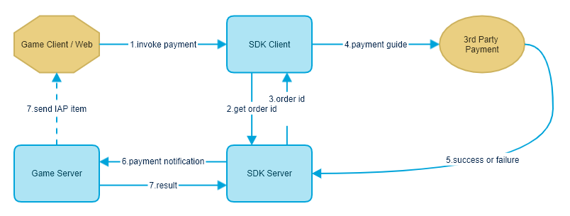

# 内购商品付款通知(Instant Payment Notification)

### 接口说明

内购商品即时付款通知(Instant Payment Notification)由游戏商提供API给发行商设置，当玩家付款成功后发行商服务器将通知游戏商服务器。

### 流程图



图中第6步就是即时付款通知步骤, SDK服务器主动触发, 然后通过HTTP请求的方式通知游戏商游戏服务器

### 请求地址

开发商自定并告知发行商 [http://yourdomain.com/ipn.php](http://yourdomain.com/ipn.php)

### 请求方式(发行商服务器请求游戏商服务器)

POST

### 请求参数

|字段名|是否必填|类型|说明|
|---|---|---|---|
|time|是|int|当前时间(10位时间戳)|
|paymentDate|是|int|交易时间（10位时间戳）|
|tradeId|是|string|发行商交易号(游戏商判断重复交易)|
|productId|否|string|商品ID(官网充值为空)|
|serverId|是|string|区服ID|
|accountId|是|string|发行商账号ID|
|roleId|是|string|角色ID|
|currencyCode|是|string|货币 默认货币 USD|
|amount|是|decimal(14,2)|金额 9.99|
|extra|否|string|拓展字段 (透传值) (游戏官网充值为空字符串) (游戏商接入SDK，支付时传入) (如果游戏商传入订单号，请不要用此订单号做订单重判断)|
|promotion|否|float|促销比例，0.2 多送20%元宝|
|originalCurrencyCode|是|string|汇率兑换前原始付款币种 TWD|
|originalAmount|是|decimal(14,2)|汇率兑换前原始付款金额 300.00|
|originalRate|是|string|付款货币与默认货币汇率 0.03473122|
|paymentStatus|是|string|交易状态 <br />completed 交易成功|
|paymentChannelId|是|string|付款渠道|
|mode|是|string|live 正式交易，sandbox 测试交易（最终以账单为准）|
|signature|是|string|签名 [参考签名规则](server-api-overview.md#签名规则)|

**小提示：**

1. 通知参数会动态新增，请不要接收固定参数加密签名。
2. 请游戏商按发行商交易号做交易重复检测。如果第一次推送充值成功，第二次以后的推送直接返回成功状态。
3. 发行商收到玩家付款成功通知后，会即时请求游戏商，当游戏商响应结果失败时，我方系统会在7分钟内自动推送3请求。
4. 游戏币数量计算向上取整。例如：ceil(11.1) = 12，ceil(11.6) = 12
5. 充值失败，请返回详细的失败原因，方便双方排查问题。

### 返回结果JSON

成功返回

```json
{
    "resultCode": 200,
    "message": "Success",
    "data" : []
}
```

失败返回

```json
{
    "resultCode": 40101,
    "message": "签名错误",// 具体错误信息游戏商自定义，建议详细。
    "data" : []
}
```

### 规则说明(仅供参考)

**普通商品充值：**

```
元宝换算比例（举例说明）：1 USD = 60 元宝

规则一：官网充值extra没有值。

规则二：充值金额与商品金额相同，发放规则按商品规则发放。

规则三：充值金额与商品金额不相同。

        首充：判断最近商品金额给双倍。例如：充值 1.28 USD. 最近商品是0.99 (0.99 = 60元宝), 发放规则为 (60 * 2) +  ((1.28 - 0.99) * 60)。

        非首充：判断最近商品金额给单倍。例如：充值 1.28 USD. 最近商品是0.99 (0.99 = 60元宝), 发放规则为 60 +  ((1.28 - 0.99) * 60)。

        未匹配到最近商品。例如：充值 0.28 USD. 最小商品是0.99 (0.99 = 60元宝), 那么直接按比例发放 0.28 * 60。

规则举例说明：

        玩家选择99.99商品，使用第三方支付，选择台湾在线银行支付。支付 2000 TWD。 我方汇率兑换后 2000 TWD = 65 USD。回调金额为 65 USD，(充值金额小于商品金额，请参考规则三)。

        玩家选择99.99商品，使用第三方支付，选择台湾在线银行支付。支付 4000 TWD。 我方汇率兑换后 4000 TWD = 130 USD。回调金额为 130 USD，(充值金额大于商品金额，请参考规则三)。

        玩家选择99.99商品，选择第三方支付，选择信用卡支付，回调金额为 99.99 USD。

        玩家选择99.99商品，选择 Google Play 或 iOS 支付，回调金额为 99.99 USD。
```

**月卡充值：**

```
月卡商品为 3.99 USD。

规则一：玩家选择月卡商品，但玩家充值 20.23 USD，充值金额大于月卡金额，给玩家发月卡。剩余金额按比例发放元宝(20.23 - 3.99) * 60。

规则二：玩家选择月卡商品，但玩家充值 1.23 USD，充值金额小于月卡金额。购买月卡失败。直接按比例发放元宝 1.23 * 60。

备注：

    玩家点击月卡商品才能发放月卡，其它普通商品充值不能发放月卡。 官网不支持月卡支付。
```

**返利说明：**

```
回调数据中会推送 promotion 参数。 值为 0.1    0.2   0.3 ... 0.1 多发10%元宝。以此类推。

换算比例：1 USD = 60 元宝

例如：玩家使用信用卡充值 1.23 USD。我们系统已对信用卡配置返利10%。 计算公式为：(1.23 USD 通过以上规则计算可得元宝数) + (1.23 * 0.1 * 60) = 最终给玩家的元宝数。
```
